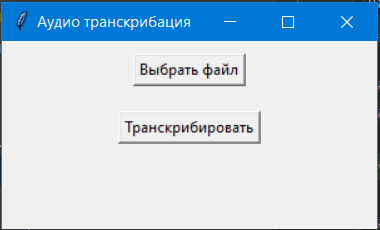

# Программа для транскрибирования(распознавания речи) аудио wav формата
#### Программа написана на python

Данная программа разработана и написана мною для распознавания речи аудиофайлов(wav формата) с диктофона




##### Для запуска программы из IDE для начала нужно создать виртуальное окружение:
####
```sh
python -m venv venv
```
##### Далее установим все зависимости:

```sh
pip install -r -requirements.txt
```

Если необходимо установить расширенную базу(для лучшего распознавания речи), то нужно скачать её с официального сайта vosk, положить в корневую директорию и
записать её в переменную:

```sh
model = vosk.Model("vosk-model-small-ru-0.22")
```

##### Запуск программы осуществляется командой:

```sh
python main.py
```

#
### Автор:
**uHDezuT**